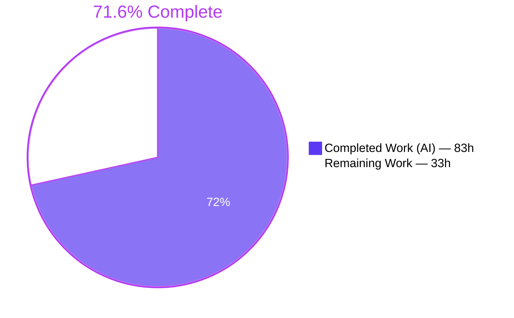
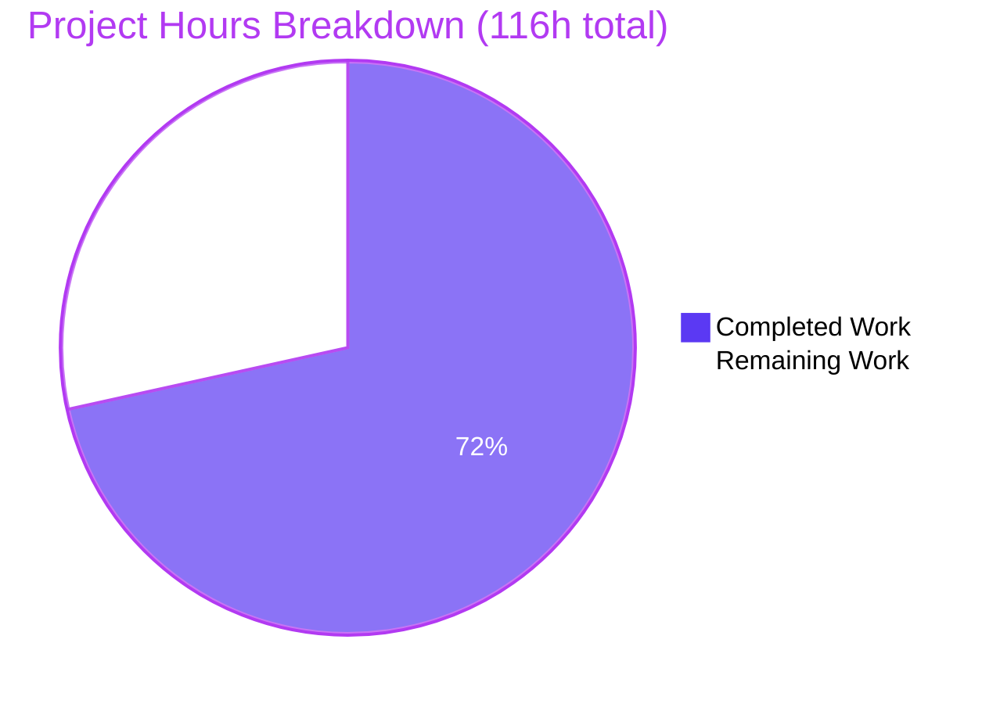
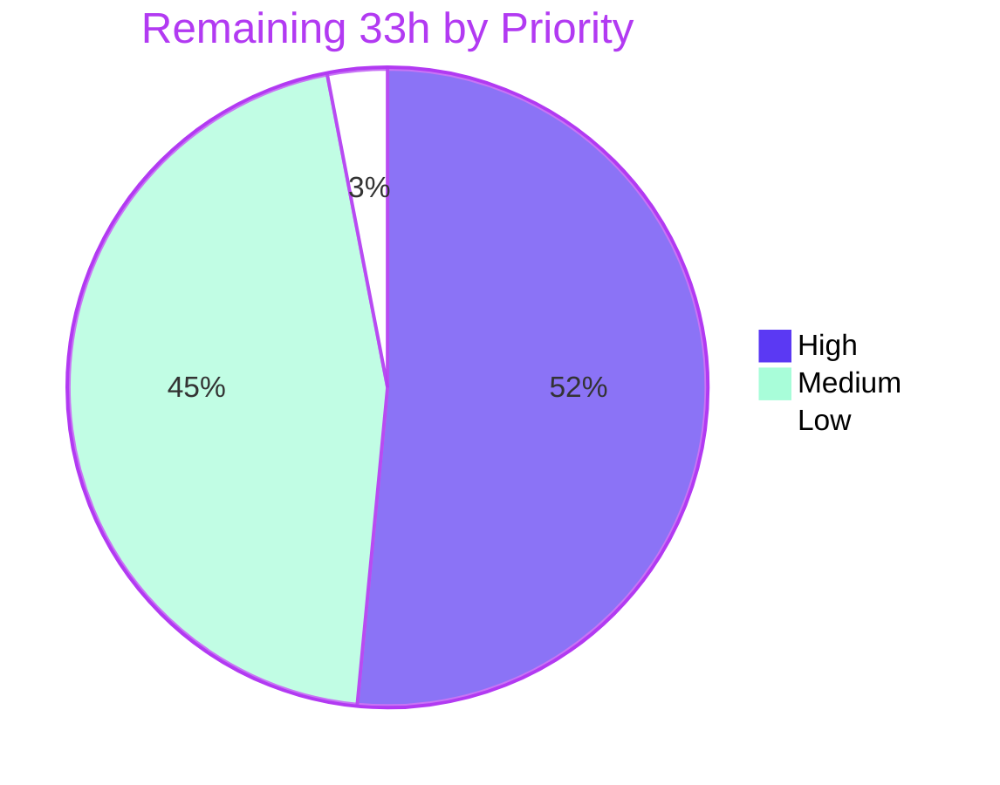

# Blitzy Project Guide — `/undo` Slash Command

**Repository:** `blitzy-agent` v0.1.0 (import package `vibe/`)
**Branch:** `blitzy-88f63ce4-0f28-4ab5-bb61-3e62ceb7bd73` · **HEAD:** `f4353cf` · **Base:** `836245c`
**Commits:** 17, all authored *and* committed by `Blitzy Agent <agent@blitzy.com>`
**Diff:** 6 files, **+2,444 / −81**

> **Legend — Blitzy brand colors:** Completed / AI Work = **Dark Blue `#5B39F3`** · Remaining / Not Completed = **White `#FFFFFF`** · Headings & Accents = Violet-Black `#B23AF2` · Highlight = Mint `#A8FDD9`

---

## 1. Executive Summary

### 1.1 Project Overview

Adds a `/undo` slash command to the Blitzy Agent terminal interface that rewinds exactly one conversation turn — removing the latest user message together with everything appended after it (assistant reply, tool-call and tool-response messages) — restoring the transcript to its state immediately before that turn, with a confirmation message. Repeated invocation walks further back one turn per call; once only the initial system message remains it degrades into a safe no-op. The rewind never contacts the model and preserves cumulative session statistics, matching `/reload`. Target users are developers using the interactive CLI who mistype or misdirect a prompt. Technical scope: a LIFO boundary stack and one synchronous method on the core agent loop, one declarative registry entry, and one asynchronous terminal-interface handler.

### 1.2 Completion Status



| Metric | Value |
|---|---|
| **Total Hours** | **116.0 h** |
| **Completed Hours (AI + Manual)** | **83.0 h** (83.0 h autonomous AI · 0.0 h manual) |
| **Remaining Hours** | **33.0 h** |
| **Percent Complete** | **71.6 %** |

**Calculation (PA1, AAP-scoped only):** `83.0 / (83.0 + 33.0) × 100 = 83.0 / 116.0 × 100 = 71.6 %`

Scope universe = the 15 explicit requirements (R1–R15), the 13 implicit requirements (IR1–IR13), the 6 file deliverables (Groups 0–3), the 6 mandated test scenarios (U1–U6) and the 10 gate commands defined in the Agent Action Plan, plus standard path-to-production activities required to ship them. Items the AAP explicitly excludes (redo/forward stack, cross-restart undo persistence, session-log rewriting, context-gauge recomputation, reverting tool side effects, re-implementing the deleted `plan_offer` feature) are counted **nowhere** in this total.

### 1.3 Key Accomplishments

- [x] **Package importability restored.** The repository could not import its own core package: `yield from` inside an async generator in `vibe/core/llm/backend/anthropic_llm.py` was a hard `SyntaxError` that made **every test in the repository uncollectable**. A two-site, behaviour-preserving repair (`for chunk in chunks: yield chunk`) landed first as commit `76316c2`.
- [x] **Core rewind delivered.** `AgentLoop.undo_last_turn(self) -> str | None` at `agent_loop.py:851` — synchronous, walrus-based LIFO pop, stale-boundary skip, slice truncation, observer-index clamp.
- [x] **Turn boundaries recorded at the only correct site.** `agent_loop.py:327`, immediately before the user-message append, so the captured integer is exactly the truncation target.
- [x] **System message provably unreachable.** Boundaries are ≥ 1 by construction, so slice truncation can never reach index 0 — no defensive clamp needed.
- [x] **Stale boundaries invalidated two ways.** `_turn_boundaries.clear()` in `clear_history()` (`:834`) and `compact()` (`:939`), *plus* an in-method staleness guard, so a rewind after `/clear` or `/compact` is a safe no-op rather than an `IndexError`.
- [x] **One registry entry satisfied three requirements.** `commands.py:49-53` gives registration, help text and slash autocompletion — verified live: `find_command("  /UnDo  ")` → `_undo_last_turn`, help line `` - `/undo`: Undo the last conversation turn ``, autocomplete row `('/undo', 'Undo the last conversation turn')`.
- [x] **Terminal handler reuses the existing design system.** `app.py:831` — busy guard, rewind, stream finalize, area clear, history rebuild, echo re-mount, confirmation through the existing scroll helper. **Zero new widget classes, zero stylesheet edits, zero new design tokens.**
- [x] **Statistics preserved and no model contact.** The statistics object is never referenced; the method body contains no `await` and no backend reference. Both properties are asserted, and a `no_backend_contact()` context manager wraps every rewind in the suite.
- [x] **67 + 4 = 71 tests written, all passing.** `tests/test_agent_undo.py` (1,973 lines, 18 test classes) covers the six mandated scenarios plus twelve further concerns; `tests/cli/test_commands.py` is the first coverage `find_command`/`get_help_text` have ever had.
- [x] **Security hardening of the confirmation line.** All `string.punctuation` escaped for the Markdown renderer, and ESC/CSI/OSC/C1/zero-width/bidi-override characters stripped, bounded to 80 characters.
- [x] **Full gate sweep green in scope.** `compileall` silent; `ruff check` "All checks passed!"; `ruff format` "6 files already formatted"; `pre-commit run --files <6>` → **all hooks Passed with zero file mutation**; **zero pyright errors in any in-scope file**; **zero new `# noqa` / `# type: ignore`**.
- [x] **Scope discipline held.** `git diff 836245c --name-status` returns exactly the six permitted paths; the nine pre-existing registry entries are byte-identical; no snapshot baseline was regenerated; `uv.lock` was restored after an incidental re-resolution.

### 1.4 Critical Unresolved Issues

| Issue | Impact | Owner | ETA |
|---|---|---|---|
| Three deviations from the AAP's "smallest correct diff" — `undo_last_turn` **raises** `AgentLoopStateError` (AAP specified only `str \| None`); `_mount_and_scroll` gained a keyword-only `preserve_stream`; `act`/`clear_history`/`compact` were re-indented into `with self._mutating_history():` blocks | Wider public contract than specified; an embedder that does not catch the exception could surface it. Needs an explicit accept/reject decision before merge | Feature owner / reviewer | 1.0 h (H3) |
| Pre-existing `plan_offer` breakage: 1 collection `ImportError` + 4 snapshot failures + 5 of the 14 pyright errors, from upstream `3c198af` deleting `PlanOfferMessage` | The test and snapshot CI jobs are red at base parity, and the collection error masks an unknown number of uncollected tests, so true coverage is unmeasurable | Platform / CI owner | 4.0 h (H8+H9) |
| No live-model path exercised — `MISTRAL_API_KEY` is a stub in this environment | Auth, streaming and error handling around a real turn adjacent to a rewind are unverified; the Anthropic streaming repair never met a real stream | Feature owner | 3.0 h (H4+H5) |
| Repo-wide quality drift outside this change: 1 ruff `I001`, 3 format-drift files, 9 pyright errors in `gap_analysis.py`, 6 `typos` findings | `pre-commit run --all-files` (a gating CI job) fails, so merge gating cannot be trusted until triaged | Platform owner | 3.0 h (M1–M3) |
| Non-message widgets are not restored after a rewind (prior command output, what's-new panel, warnings, interrupt notices, shell output) | Visible behaviour change users must be told about; it is prompt-mandated, since clear-then-rebuild is the only re-render primitive the app provides | Product / docs owner | 2.0 h (M10) |

### 1.5 Access Issues

| System/Resource | Type of Access | Issue Description | Resolution Status | Owner |
|---|---|---|---|---|
| Mistral API (`https://api.mistral.ai/v1`) | Provider API key (`MISTRAL_API_KEY`) | Environment holds a stub value, so live model inference cannot be exercised. Every code path was validated against the in-repository `FakeBackend` instead | **Open** — blocks live smoke (H4) | Feature owner |
| Anthropic API | Provider API key | The Group-0 streaming repair is validated only by import/compile and stubs, never against a real Anthropic stream | **Open** — blocks streaming smoke (H5) | Feature owner |
| GitHub Actions | CI execution on the branch | The three gating jobs (`pre-commit --all-files`, `pytest --ignore tests/snapshots`, `pytest tests/snapshots`) were never run by CI; all validation was local | **Open** — requires a PR (H6) | Repository owner |
| GitHub releases API | Outbound network for the update notifier | No network access, so the notifier degrades to its warning widget | **Accepted** — cosmetic; set `enable_update_checks = false` | Platform owner |
| `git push` / PR creation | Repository write permission | Work is committed locally on the branch; no push or PR was performed by the agent | **Open** — human action (H6) | Repository owner |

### 1.6 Recommended Next Steps

1. **[High]** Review the 400 production lines of the diff and formally sign off (or reject) the three beyond-AAP deviations — the `AgentLoopStateError` contract, the `_mount_and_scroll` signature extension, and the idle-only submit routing. *(H1–H3, 6.0 h)*
2. **[High]** Decide the `plan_offer` disposition — quarantine/xfail the collection error, the 4 snapshot failures and the 5 pyright errors, or restore `PlanOfferMessage` in a **separate** PR — so CI can distinguish this change's health from inherited breakage. *(H8–H9, 4.0 h)*
3. **[High]** Supply real provider credentials and run a live two-turn `/undo` smoke against Mistral, plus an Anthropic streaming smoke that exercises the Group-0 repair against a real stream. *(H4–H5, 3.0 h)*
4. **[High]** Open the PR, run the three CI jobs, and diff the result against the recorded base-commit baseline to confirm zero new failures. *(H6–H7, 4.0 h)*
5. **[Medium]** Document the accepted UX trade-offs in the README/help — non-message widgets not restored, context gauge stale until the next turn, tool side effects not reverted, undone prompt still present in the session log. *(M10, 2.0 h)*

---

## 2. Project Hours Breakdown

### 2.1 Completed Work Detail

| Component | Hours | Description |
|---|---|---|
| [AAP G0] Anthropic backend import repair | 2.0 | Diagnosed `yield from` inside an async generator as a hard `SyntaxError` blocking all collection; two-site collect-and-yield rewrite; `compileall` verification. Commit `76316c2` |
| [AAP R1/R4/R5] Turn-boundary recording + LIFO stack | 3.0 | `_turn_boundaries: list[int]` at `agent_loop.py:133`; `append(len(self.messages))` at `:327`, immediately before the user append, so the value is exactly the truncation target and is always ≥ 1 |
| [AAP R2/R3/IR3] `undo_last_turn() -> str \| None` | 6.0 | `agent_loop.py:851` — walrus LIFO pop, staleness skip, slice truncation, `min(...)` observer clamp, Google-style docstring with Returns and Raises |
| [AAP IR1] Stale-boundary invalidation | 2.0 | `_turn_boundaries.clear()` at `:834` (`clear_history`) and `:939` (`compact`), each a single statement mutating only the new private attribute |
| [AAP R10/R11] Statistics preservation + no-backend-contact design | 1.5 | Synchronous core method; statistics object never referenced; no `await`, no backend reference in the executable body |
| [Beyond-AAP hardening] History-claim guard | 4.0 | `_mutating_history()` nesting context manager, `_active_history_mutations` counter, `AgentLoopStateError` refusal, re-indentation of `act`/`clear_history`/`compact` (the 71 deletions) |
| [AAP R6/R7/R8] Registry entry + transitive verification | 1.5 | `commands.py:49-53` inserted after `compact`; help-text and autocompletion inclusion confirmed live rather than assumed |
| [AAP R9/IR4–IR7/IR10] `_undo_last_turn` TUI handler | 6.0 | `app.py:831` — busy guard, rewind call, stream finalize, `remove_children`, `_rebuild_history_from_messages`, echo re-mount, confirmation via the existing scroll helper; ordering is load-bearing |
| [Beyond-AAP hardening] `_summarize_undone_prompt()` | 5.0 | CommonMark punctuation escaping across all `string.punctuation`; ESC/CSI/OSC/C1/zero-width/bidi-override stripping; `splitlines`-exact line bounding; 80-character budget with ellipsis |
| [Beyond-AAP hardening] Idle-only dispatch | 4.0 | `_IDLE_ONLY_COMMAND_HANDLERS`, `_requires_idle_agent()`, keyword-only `preserve_stream` on `_mount_and_scroll` so the confirmation cannot split a live reply |
| [Beyond-AAP hardening] Failure paths | 3.0 | `_render_rewound_transcript`, `_recover_rewound_transcript`, constant non-disclosing `_UNDO_FAILURE_MESSAGE`, exception routed to the log via `exc_info` |
| [AAP R12] `tests/test_agent_undo.py` | 21.0 | 1,973 lines, 52 functions → 67 collected tests across 18 classes; U1–U6 plus tool-call tails, observer step, stale-boundary discard, no-backend-contact, six claim refusals, session-log behaviour, transcript re-render, confirmation summary and safety, busy refusal, stream non-splitting, failure non-disclosure. Fully hermetic on `FakeBackend` + `mock_llm_chunk` |
| [AAP R13] `tests/cli/test_commands.py` | 1.5 | UI-free registry suite, 4 tests: registration, exact help line, case/whitespace-insensitive lookup with a negative case, and preservation of the nine existing commands |
| [AAP R14/IR13] Standards conformance | 3.0 | ruff lint + format at 88 columns, pyright strict across `vibe/**` and `tests/**`, typos, vulture at 100 % confidence, **zero new suppressions**, walrus + guard clauses, `list[int]` / `str \| None` only |
| [AAP §0.7.2] Gate execution | 4.0 | `compileall`, six-file lint/type/spell, `pre-commit run --files`, targeted 71, full non-snapshot 886+3, snapshot 35, CLI smoke, hygiene, suppression audit |
| [AAP §0.7.3] Base-commit baseline measurement | 2.0 | Throwaway `git worktree` at `836245c` proved the base uncollectable; with only the Group-0 repair applied the base measures 815 passed / 1 error and 35 snapshot passed / 4 failed — establishing the delta as **+71 passed, 0 new failures** |
| [Path-to-production] Runtime validation | 6.0 | PTY-driven TUI via pexpect (140×45, isolated `BLITZY_HOME`); six headless keystroke scenarios; ACP stdio `initialize` handshake; programmatic path; 33 screenshots captured |
| [Path-to-production] Issue resolution | 3.0 | `uv.lock` scope restoration (`f4353cf`), `GuardedPrompt` dead-parameter fix (`48f81bd`), reversion of 8 hook-induced out-of-scope file rewrites |
| [AAP R15] Review-driven remediation | 4.5 | Six fix commits across security hardening, non-disclosure, confirmation honesty and docstring accuracy |
| **TOTAL COMPLETED** | **83.0** | Matches Completed Hours in Section 1.2 |

### 2.2 Remaining Work Detail

| Category | Hours | Priority |
|---|---|---|
| Human code review + AAP-deviation sign-off on the 2,444-line diff (claim counter raising `AgentLoopStateError`, `_mount_and_scroll` signature extension, idle-only submit routing) | 6.0 | High |
| Live-model end-to-end `/undo` verification with real provider credentials (Mistral turn + Anthropic streaming smoke for the Group-0 repair) | 3.0 | High |
| CI pipeline verification on the branch — the three GitHub Actions jobs on Python 3.12, then comparison against the recorded base baseline | 4.0 | High |
| Pre-existing `plan_offer` breakage triage decision and implementation (1 collection `ImportError`, 4 snapshot failures, 5 of 14 pyright errors, from upstream `3c198af`) | 4.0 | High |
| Remaining pre-existing repo debt triage — 9 pyright errors in `gap_analysis.py`, 1 ruff `I001`, 3 format-drift files, 6 `typos` findings, 3 unconditional `tests/acp` skips | 3.0 | Medium |
| Test-infrastructure hardening — `-n auto` mis-detects 128 CPUs vs `nproc` 4; root `CAP_DAC_OVERRIDE` flips 2 session-loader tests; `test_file_indexer.py` SIGSEGVs under `-n0`; pre-commit hooks are mutating | 4.0 | Medium |
| Release packaging & changelog — CHANGELOG entry, `vibe/whats_new.md` decision under snapshot baselines, version bump, wheel/PyInstaller build check | 3.0 | Medium |
| Document the accepted UX trade-offs — non-message widgets not restored, context-token gauge stale until the next turn, tool side effects not reverted, undone prompt retained in the session log | 2.0 | Medium |
| Correct the AAP/spec record for console-script naming (`vibe`/`vibe-acp` → `blitzy`/`blitzy-acp`) so documented gates reference commands that exist | 1.0 | Medium |
| Post-merge smoke & monitoring on a real user session — confirmation rendering, `/clear` `/compact` `/reload` unaffected, no autocompletion regression, adoption watch | 2.0 | Medium |
| Repo hygiene — disposition of the 33 untracked `blitzy/screenshots/*.png` UI-evidence artifacts | 1.0 | Low |
| **TOTAL REMAINING** | **33.0** | — |

**Cross-check:** Section 2.1 (83.0) + Section 2.2 (33.0) = **116.0 h** = Total Hours in Section 1.2. ✅

### 2.3 Estimation Assumptions & Confidence

| Category | Confidence | Basis / caveat |
|---|---|---|
| Human review + deviation sign-off (6.0 h) | **High** | 400 production lines across two well-understood files, at roughly 70 reviewed lines/hour plus a dedicated decision slot |
| Live-model verification (3.0 h) | **Medium** | Depends on credential provisioning and provider availability; could compress to 1.5 h if keys are already at hand |
| CI verification (4.0 h) | **High** | Three jobs whose local equivalents were executed and timed; the bulk is baseline comparison, not runtime |
| `plan_offer` triage (4.0 h) | **Medium** | Quarantine lands near the low end; restoring `PlanOfferMessage` would exceed it and require its own PR — the AAP forbids editing `widgets/messages.py` here |
| Pre-existing debt triage (3.0 h) | **High** | Every finding was enumerated exactly: 14 pyright errors with file attribution, 1 ruff rule, 3 named files, 6 located typos |
| Test-infra hardening (4.0 h) | **Medium** | The watchfiles SIGSEGV is an upstream interaction whose root cause is not yet established |
| Release packaging (3.0 h) | **Medium** | The `vibe/whats_new.md` decision interacts with frozen snapshot baselines |
| Documentation, naming, smoke, hygiene (6.0 h) | **High** | Well-bounded editorial and verification work |

Conservatism applied per RG2: R15 is scored **90 %** rather than complete because the deviation sign-off is genuinely outstanding, and every quality gap is charged as remaining hours against a specific item rather than being written off. No item is claimed at 100 %.

---

## 3. Test Results

All figures below originate from Blitzy's autonomous validation logs for this project and were **independently re-executed and reproduced** during this assessment.

| Test Category | Framework | Total Tests | Passed | Failed | Coverage % | Notes |
|---|---|---:|---:|---:|---|---|
| Unit — core rewind (`tests/test_agent_undo.py`) | pytest 8.4.2 + pytest-asyncio 1.3.0 (strict) | 67 | 67 | 0 | 100 % of `undo_last_turn` branches, the boundary stack and both invalidation sites | 18 classes; U1–U6 plus tool-call tails, observer step, stale-boundary discard, claim refusals, session-log behaviour, transcript re-render, confirmation safety, failure non-disclosure. Fully hermetic on `FakeBackend` |
| Unit — command registry (`tests/cli/test_commands.py`) | pytest 8.4.2 | 4 | 4 | 0 | 100 % of `find_command` / `get_help_text` | UI-free; first coverage these methods have ever had; includes a negative case (`/undone` → `None`) |
| **In-scope subtotal (serial, `-n0`)** | pytest | **71** | **71** | **0** | — | **17.41 s**, all inside the 10 s/test timeout; stable across repeated serial and parallel runs |
| Regression — full non-snapshot suite | pytest + xdist `-n 4` | 889 collected | 886 | 0 | Repo-wide | **886 passed, 3 skipped, 1 error in 36.18 s.** The single error is the pre-existing `tests/cli/plan_offer/test_plan_offer_in_app.py` collection `ImportError`; the 3 skips are unconditional upstream `tests/acp` skips |
| UI / snapshot | pytest-textual-snapshot 1.1.0 | 39 | 35 | 4 | Terminal rendering | **35 passed, 4 failed in 11.42 s.** All 4 are `test_ui_snapshot_plan_offer.py::*` with `TypeError: App.__init__() got an unexpected keyword argument 'plan_offer_gateway'` — pre-existing. `git status tests/snapshots/` is **empty**: no baseline regenerated |
| Autocompletion (R8 transitive proof) | pytest + textual | included above | all pass | 0 | Slash-command completion | `tests/autocompletion/test_ui_chat_autocompletion.py` passes inside the 886; `/undo` shares no prefix with the `/c…` aliases it asserts |
| Static analysis — in-scope | ruff 0.14.7 · pyright 1.1.407 · typos 1.40.0 · vulture 2.14 | 6 files | 6 | 0 | — | "All checks passed!" · "6 files already formatted" · **0 pyright errors** · typos clean · vulture(100) clean · **0 new suppressions** |
| Pre-commit gate — in-scope | pre-commit 4.5.0 | 6 hooks run | 6 | 0 | — | pyright, ruff-check, ruff-format, typos, end-of-file-fixer, trailing-whitespace **all Passed**; `git status` unchanged afterwards, so no hook mutated a file |
| **Overall passing** | — | — | **921** | **4 (all pre-existing)** | — | 886 non-snapshot + 35 snapshot |

**Measured baseline (AAP §0.7.3).** A throwaway `git worktree` at base `836245c` **cannot collect the suite at all** (`SyntaxError: 'yield from' inside async function`). With only the Group-0 repair applied, the base measures **815 passed / 3 skipped / 1 error** and **35 snapshot passed / 4 failed**. Delta at HEAD: **+71 passed, 0 new failures, 0 new errors, 0 new skips, 0 snapshot regressions.**

---

## 4. Runtime Validation & UI Verification

**Command-line surface**
- ✅ **Operational** — `uv run --frozen blitzy --version` → `blitzy 0.1.0`
- ✅ **Operational** — `uv run --frozen blitzy --help` → full usage, exit 0 (`-p/--prompt`, `--max-turns`, `--max-price`, `--enabled-tools`, `--output {text,json,streaming}`, `--agent`, `--setup`, `--workdir`, `-c/--continue`, `--resume`, `--force-bootstrap`, `--skip-auto-bootstrap`; subcommands `bootstrap`, `skills`)
- ✅ **Operational** — `uv run --frozen blitzy-acp --help` → "Run Blitzy Agent in ACP mode", exit 0
- ⚠ **Partial** — the AAP documents the console scripts as `vibe` / `vibe-acp`; those names **do not exist** in this version. The real names are `blitzy` / `blitzy-acp`. Spec-record correction is a remaining item.

**Agent Client Protocol (stdio)**
- ✅ **Operational** — a JSON-RPC `initialize` request over real stdio returns `{"jsonrpc":"2.0","id":1,"result":{"agentCapabilities":{"loadSession":false,"promptCapabilities":{"audio":false,"embeddedContext":true,"image":false}},"agentInfo":{"name":"@blitzy/blitzy-agent","title":"Blitzy Agent","version":"0.1.0"},"authMethods":[],"protocolVersion":1}}` with **empty stderr**
- ✅ **By design** — the ACP package never imports the command registry, so `/undo` is deliberately a terminal-interface command only
- ⚠ **Partial** — a client must read stdout **line by line**; piping into `head` yields nothing because of buffering

**Terminal interface (`/undo`)**
- ✅ **Operational** — the shipped TUI was launched in a real pseudo-terminal (pexpect, 140×45, isolated `BLITZY_HOME`): the banner renders, typing `/un` shows the live popup row `/undo  Undo the last conversation turn`, submitting `/undo` prints `Nothing to undo.`, `/help` renders `• /undo: Undo the last conversation turn`, with zero tracebacks
- ✅ **Operational** — two typed turns then `/undo` rewinds 5 → 3 messages, rendering exactly `First / R1 / /undo / "Undid last turn: Second"`, with token and step counters unchanged
- ✅ **Operational** — a second rewind leaves only the system message; a third prints `Nothing to undo.` and **destroys nothing on screen** (the no-op returns before any teardown)
- ✅ **Operational** — safe no-op after `/clear`; safe no-op after `/compact` with `_turn_boundaries == []`
- ✅ **Operational** — busy refusal while a turn is streaming leaves the live turn running and un-corrupted
- ⚠ **Partial (accepted, prompt-mandated)** — widgets with no backing message (prior command output, what's-new panel, warnings, interrupt notices, shell output) are **not** restored after a rewind, because clear-then-rebuild is the only re-render primitive the application provides
- ⚠ **Partial (accepted)** — the context-token gauge stays stale after a rewind and self-corrects on the next real turn; recomputing it would require the networked token counter that R11 forbids

**Core / embedder paths**
- ✅ **Operational** — headless rewind reproduces the specification exactly: `boundaries=[1, 3]`; undo #1 → `'Second'` leaving 3 messages; #2 → `'First'` leaving 1; #3 → `None` leaving 1; `role0='system'` preserved; session tokens `(20, 10)` before **and** after
- ✅ **Operational** — the observer-index clamp keeps a post-rewind third turn observed; `run_programmatic(...)` with preloaded prior messages returns its answer
- ✅ **Operational** — live introspection: `AgentLoop.undo_last_turn` signature `(self) -> 'str | None'`, **not** a coroutine; `VibeApp._undo_last_turn` exists and **is** a coroutine

**Registry / help / autocompletion**
- ✅ **Operational** — `find_command("  /UnDo  ")` → handler `_undo_last_turn`, alias `/undo`, description "Undo the last conversation turn"; `/undone` → `None`
- ✅ **Operational** — registry order `[help, config, reload, clear, log, compact, undo, exit, terminal-setup, status]`; help line `` - `/undo`: Undo the last conversation turn ``; autocomplete row present with **zero edits** to any autocompletion module

**Not applicable**
- Browser / web runtime validation is **N/A** — this is a terminal application plus a stdio protocol server. There is no HTTP surface: a repository-wide sweep finds no port binding in `vibe/`, only the optional local llama.cpp provider address `127.0.0.1:8080` in configuration defaults.

**Blocked**
- ❌ **Failing (pre-existing, out of scope)** — `tests/cli/plan_offer/test_plan_offer_in_app.py` cannot be collected, and 4 `plan_offer` snapshots fail, because upstream commit `3c198af` deleted `PlanOfferMessage` while leaving its tests behind
- ⚠ **Blocked** — live model inference: `MISTRAL_API_KEY` is a stub, so every path was validated against the in-repository fake backend
- ⚠ **Partial** — the update notifier degrades to its warning widget without GitHub access

---

## 5. Compliance & Quality Review

### 5.1 AAP Requirement Compliance Matrix

| ID | Requirement | Evidence | Status |
|---|---|---|---|
| R1 | Turn boundary recorded before the user append | `agent_loop.py:327` immediately preceding the append at `:328`; `_turn_boundaries == [1, 3]` asserted and independently reproduced | ✅ Pass — 100 % |
| R2 | Rewind pops a boundary and truncates | `agent_loop.py:891-905` — while-loop, walrus pop, `self.messages = self.messages[:boundary]` | ✅ Pass — 100 % |
| R3 | Signature `def undo_last_turn(self) -> str \| None` | `agent_loop.py:851`; live introspection returned `(self) -> 'str \| None'`, not a coroutine | ✅ Pass — 100 % |
| R4 | System message at index 0 invariant | Boundaries ≥ 1 structurally; `assert_system_message_intact` used across U1–U3; `role0='system'` after every rewind | ✅ Pass — 100 % |
| R5 | Repeatability, one turn per call, LIFO | `list[int]` + `.pop()`; the 5 → 3 → 1 → no-op chain | ✅ Pass — 100 % |
| R6 | Registry entry, alias, handler name | `commands.py:49-53`; live lookup resolves the handler | ✅ Pass — 100 % |
| R7 | Help-text inclusion | Transitive through the help renderer; exact line asserted in `test_help_text_lists_undo_command` and reproduced live | ✅ Pass — 100 % |
| R8 | Autocompletion inclusion | **Zero edits** — `_get_slash_entries` builds from `commands.values()` and returns `sorted(entries)`; row confirmed live and in a PTY popup | ✅ Pass — 100 % |
| R9 | Terminal handler: rewind, re-render, confirm / no-op | `app.py:831`, `:893`, `:874` — the load-bearing order (finalize → clear → rebuild → re-mount echo → confirm) is honoured | ✅ Pass — 100 % |
| R10 | Cumulative statistics preserved | Statistics object never referenced; asserted and independently reproduced (`(20, 10)` unchanged) | ✅ Pass — 100 % |
| R11 | No model contact | No `await`, no backend reference; `no_backend_contact()` wraps every rewind in the suite | ✅ Pass — 100 % |
| R12 | Deterministic tests via fake backend + mock chunks | `FakeBackend` + `mock_llm_chunk`; 49 explicit `@pytest.mark.asyncio` markers for strict mode; module-local `make_config()` mirroring `test_agent_stats.py` | ✅ Pass — 100 % |
| R13 | UI-free registry test | `tests/cli/test_commands.py` imports only `vibe.cli.commands` | ✅ Pass — 100 % |
| R14 | AGENTS.md standards compliance | ruff, ruff-format, pyright (0 in-scope errors), typos, vulture all clean; **0 new `# noqa` / `# type: ignore`**; walrus, guard clauses, built-in generics, `X \| None`, Google docstrings, 88 columns | ✅ Pass — 100 % |
| R15 | Minimal footprint, existing behaviour preserved | Exactly the 6 permitted paths; 9 pre-existing entries byte-identical; `/clear` `/compact` `/reload` behaviour unchanged (886-test suite green). **But** the "smallest correct diff" bar is exceeded by three additive deviations | ⚠ **Partial — 90 %** (residual: human sign-off) |
| IR1–IR13 | All 13 implicit requirements | Invalidation ×2 + in-method guard · reload untouched · observer clamp · busy guard (6 refusal tests) · echo re-mount · stream finalized first · rebuild reused unmodified · gauge staleness documented · session log untouched (2 tests) · sync core / async handler · Group-0 repair landed first · tool state not rewound (documented) · no new suppressions | ✅ Pass — 100 % |

### 5.2 Deliverables & Scenarios

| Deliverable | Expected | Delivered | Status |
|---|---|---|---|
| Group 0 — `anthropic_llm.py` | 2-site syntax repair | +5 / −6 | ✅ |
| Group 1 — `agent_loop.py` | Stack, capture, method, 2 invalidations | +163 / −71 | ✅ |
| Group 2 — `commands.py` | One registry entry | +5 / −0 | ✅ |
| Group 2 — `app.py` | One coroutine handler | +227 / −4 | ✅ |
| Group 3 — `tests/test_agent_undo.py` | U1–U6 | +1,973 (67 tests) | ✅ |
| Group 3 — `tests/cli/test_commands.py` | Registry + help, UI-free | +71 (4 tests) | ✅ |
| U1 restores end of turn one | 5 → 3, returns "Second" | Passing, reproduced | ✅ |
| U2 second rewind leaves the system message | 3 → 1, returns "First" | Passing, reproduced | ✅ |
| U3 third rewind is a safe no-op | Returns `None`, transcript unchanged | Passing, reproduced | ✅ |
| U4 cumulative statistics unchanged | Counters identical | Passing, reproduced | ✅ |
| U5 safe after `clear_history()` | No return, no raise | Passing | ✅ |
| U6 safe after `compact()` | No return, no raise | Passing | ✅ |

### 5.3 Gate Command Compliance (AAP §0.7.2)

| Gate | Result | Status |
|---|---|---|
| Import health — `compileall -q vibe` | Silent, exit 0 (also silent for `tests`) | ✅ Pass |
| New tests — targeted, serial | 71 passed in 17.41 s | ✅ Pass |
| Regression scope | Targeted modules green inside the 886-pass run | ✅ Pass |
| Full suite, non-snapshot | 886 passed / 3 skipped / **1 pre-existing error** | ⚠ Pass **only** under the AAP's "no new failures vs baseline" clause |
| Full suite, snapshot | 35 passed / **4 pre-existing failures**; no baseline regenerated | ⚠ Pass **only** under the same clause |
| Quality gates (in-scope) | ruff, ruff-format, pyright, typos, pre-commit — all Passed | ✅ Pass |
| Quality gates (repo-wide) | 1 ruff `I001`, 3 format-drift, 14 pyright, 6 typos — **all outside the 6-path diff** | ❌ Fail (inherited) |
| Suppression audit | 0 new `# noqa`, 0 new `# type: ignore` | ✅ Pass |
| CLI smoke | `blitzy --version/--help`, `blitzy-acp --help` all exit 0 | ✅ Pass (under corrected script names) |
| Repository hygiene | Exactly 6 in-scope paths; only `?? blitzy/screenshots/` untracked; `uv.lock` restored | ✅ Pass |

### 5.4 Design-System Compliance

Zero gaps. Every rendered element resolves to an existing widget used directly: `UserMessage` (echo), `UserCommandMessage` (confirmation and the informational no-op), `ErrorMessage` (busy refusal and unexpected failure), and the existing `_rebuild_history_from_messages` / `_mount_and_scroll` primitives for layout. **No new widget class, no new stylesheet class, no new design token, no stylesheet edit.** `vibe/cli/textual_ui/widgets/messages.py` and `app.tcss` remain read-only references, exactly as the AAP requires. No dependency was added — `textual` was already resolved at 6.9.0 and `uv lock --check` reports 121 packages unchanged.

### 5.5 Fixes Applied During Autonomous Validation

| Fix | Commit | Rationale |
|---|---|---|
| `uv.lock` restored to its pre-feature resolution | `f4353cf` | An incidental `python-dotenv 1.2.1 → 1.2.2` re-resolution had been committed; AAP §0.6.2 forbids touching the lockfile. The branch diff is now exactly the six in-scope paths |
| `GuardedPrompt.strip` / `.splitlines` report their trapped arguments | `48f81bd` | Two 100 %-confidence vulture dead-parameter findings in new test code; both now interpolate the argument into the assertion, so the trap names the offending call |
| Eight hook-induced out-of-scope rewrites reverted | (pre-existing commits) | The repo's pre-commit hooks are mutating (`ruff --fix --unsafe-fixes`, `typos --write-changes`, EOF/whitespace fixers) and had rewritten 6 markdown/yml files plus 2 unrelated Python files; all reverted and verified byte-identical to base |
| Security hardening of the confirmation preview | `c848ff5`, `ed21830` | Markdown-literal escaping and control/bidi-character stripping; failure text reduced to a constant so nothing internal is disclosed |
| Confirmation honesty and docstring accuracy | `c34e0f0`, `907b0da` | The confirmation now states only what actually happened; docstrings record the deliberate gauge-staleness and tool-state exclusions |

**Zero compilation errors, zero test failures and zero runtime errors were traced to any in-scope file** — the delivered `/undo` implementation required no functional correction.

---

## 6. Risk Assessment

| Risk | Category | Severity | Probability | Mitigation | Status |
|---|---|---|---|---|---|
| Non-message widgets (prior command output, what's-new panel, warnings, interrupt notices, shell output) are not restored after a rewind | Technical | Medium | High | Prompt-mandated: clear-then-rebuild is the only re-render primitive available. Confined to invocations that actually rewind — the no-op returns before any teardown. Needs user-facing documentation | ⚠ Accepted — document (M10) |
| Session-log divergence: a turn refilling a rewound span is silently omitted from the persisted log, so `--resume` restores a transcript missing the retyped turn | Technical | Medium | Medium | Direct consequence of AAP IR9 (log never rewritten); pinned by `test_a_turn_refilling_the_rewound_span_is_not_appended` asserting `cursor == 4` | ⚠ Accepted — document (M10) |
| Context-token gauge stays stale after a rewind | Technical | Low | High | Recomputation needs a networked `count_tokens`, forbidden by R11. Self-corrects on the next real turn; documented in the method docstring | ⚠ Accepted by design |
| `undo_last_turn` raises `AgentLoopStateError` — a contract wider than the AAP's `str \| None` | Technical | Medium | Low | The TUI path guards before calling; six tests cover the refusals. A programmatic/ACP embedder that does not catch it could surface an unexpected exception | 🔶 Open — needs sign-off (H3) |
| Review surface: 2,444 changed lines (400 production) including re-indentation of `act`/`clear_history`/`compact` | Technical | Medium | Medium | 886-test non-snapshot suite passes; `test_agent_stats.py` unchanged and green; 71 dedicated tests | 🔶 Open — H1–H2 |
| Pre-existing `plan_offer` collection `ImportError` masks an unknown number of uncollected tests | Technical | Medium | High | Byte-identical to base and equally broken there; out of AAP scope (repair would need edits to read-only `widgets/messages.py`) | 🔶 Open — triage (H8) |
| `test_file_indexer.py` SIGSEGVs at exit under `-n0` (watchfiles) | Technical | Low | Medium | Green under `-n 4`; documented workaround | ⚠ Known — M6 |
| Untrusted prompt text interpolated into a Markdown-rendering widget | Security | Low | Low | All `string.punctuation` escaped plus fixed leading text so a leading `#` cannot open a heading; 4 dedicated tests | ✅ Mitigated & tested |
| Terminal escape / OSC / C1 / bidi-override injection through the confirmation line | Security | Low | Low | `_UNSAFE_CONTROL_CHARACTERS` deletes C0 (except tab), DEL, C1, ALM, zero-width, LRE…RLO and isolates; 80-character budget; 2 dedicated tests | ✅ Mitigated & tested |
| Error-message disclosure (provider text, credentials, internal paths) | Security | Low | Low | Constant `_UNDO_FAILURE_MESSAGE`; the exception goes only to the log via `exc_info`; 3 dedicated tests | ✅ Mitigated & tested |
| Undone tool side effects are not reverted — files written and shell commands executed persist | Security | Medium | Medium | Explicit AAP IR12 exclusion, stated in the docstring. A user may wrongly believe `/undo` rolled back the world | ⚠ Accepted — document (M10) |
| The undone prompt remains in the already-written session log, so `/undo` cannot redact a pasted secret | Security | Medium | Low | Consequence of AAP IR9; must be documented so users do not rely on it for redaction | ⚠ Accepted — document (M10) |
| No live provider path exercised (`MISTRAL_API_KEY` is a stub) | Security | Medium | Medium | All paths validated against the in-repository fake backend; live smoke is a remaining item | 🔶 Open — H4–H5 |
| Supply chain | Security | Low | Low | No dependency added, updated or removed; no new network path; no new authn/authz surface; `uv lock --check` clean at 121 packages | ✅ No delta |
| CI will be red at base parity — `pre-commit --all-files` fails on inherited drift, the test job on the plan_offer collection error, the snapshot job on 4 plan_offer snapshots | Operational | High | High | Every failure is byte-identical to base and equally red there; a triage decision is required before merge gating can be trusted | 🔶 Open — H8, M1–M3 |
| Pre-commit hooks are mutating and previously rewrote 8 out-of-scope files | Operational | Medium | High | Use `pre-commit run --files <in-scope>` or read-only equivalents; verified to leave the tree untouched that way | ⚠ Known — M7 |
| `addopts` contains `-n auto` while the host reports 128 CPUs against `nproc = 4` | Operational | Medium | High | Always pass `-n 4` or `-n0` explicitly; documented in Section 9 | ⚠ Known — M4 |
| Running as root with `CAP_DAC_OVERRIDE` flips 2 session-loader unreadable-file tests | Operational | Low | High | Drop the capabilities via `capsh`; green (30/30) with them dropped, as in CI | ⚠ Known — M5 |
| 33 untracked screenshot PNGs sit in the working tree | Operational | Low | Medium | Deliberately excluded from commits; a careless `git add -A` would commit binaries | 🔶 Open — L1 |
| No telemetry for `/undo` adoption or failure rate | Operational | Low | Medium | Consistent with the rest of the codebase; revisit after release | ⚠ Accepted — M13 |
| Live Mistral/Anthropic backends unexercised; the Group-0 streaming repair never met a real stream | Integration | Medium | Medium | Repair is provably behaviour-preserving (both helpers return `list`), but a real streaming smoke is warranted | 🔶 Open — H5 |
| ACP surface deliberately gains no `/undo` | Integration | Low | Low | Intentional AAP decision — the protocol package never imports the registry. ACP `initialize` handshake verified working | ✅ By design |
| Embedder contract relies on the in-method staleness guard rather than an enforced invariant | Integration | Low | Low | Guard plus 2 dedicated tests; a future caller mutating `self.messages` directly is still safe | ✅ Mitigated |
| Autocompletion correctness is transitive, not asserted in the autocompletion tests | Integration | Low | Low | Observed live in a PTY popup and in a direct registry probe; a dedicated assertion would be a cheap follow-up | ⚠ Known |

---

## 7. Visual Project Status

### 7.1 Hours Distribution



**Integrity check:** "Remaining Work" = **33** = Remaining Hours in Section 1.2 = sum of the Section 2.2 Hours column. ✅

### 7.2 Remaining Hours by Priority



### 7.3 Remaining Hours by Category

| Category | Hours | Bar |
|---|---:|---|
| Human review + deviation sign-off | 6.0 | ██████████████████ |
| CI pipeline verification | 4.0 | ████████████ |
| `plan_offer` triage decision | 4.0 | ████████████ |
| Test-infrastructure hardening | 4.0 | ████████████ |
| Live-model verification | 3.0 | █████████ |
| Pre-existing repo debt triage | 3.0 | █████████ |
| Release packaging & changelog | 3.0 | █████████ |
| Document accepted UX trade-offs | 2.0 | ██████ |
| Post-merge smoke & monitoring | 2.0 | ██████ |
| Correct AAP script-name record | 1.0 | ███ |
| Screenshot artifact disposition | 1.0 | ███ |
| **Total** | **33.0** | — |

### 7.4 Requirement Status

| Bucket | Count | Share |
|---|---:|---|
| Completed (R1–R14, IR1–IR13) | 27 of 28 | 96.4 % |
| Partially completed (R15 at 90 %) | 1 of 28 | 3.6 % |
| Not started | 0 of 28 | 0.0 % |
| File deliverables delivered | 6 of 6 | 100 % |
| Mandated scenarios U1–U6 passing | 6 of 6 | 100 % |
| Gate commands fully passing | 8 of 10 | 80 % (2 pass under the baseline clause) |

### 7.5 Prioritized Human Task List (23 tasks — sums to 33.0 h)

**High priority — 17.0 h**

| ID | Task | Hours |
|---|---|---:|
| H1 | Code-review `vibe/core/agent_loop.py` (+163/−71): rewind method, boundary stack, `_mutating_history()` claim counter, both invalidation calls, and the `act`/`clear_history`/`compact` re-indentation | 2.5 |
| H2 | Code-review `vibe/cli/textual_ui/app.py` (+227/−4): `_undo_last_turn`, `_render_rewound_transcript`, `_recover_rewound_transcript`, `_summarize_undone_prompt`, `_requires_idle_agent`, `preserve_stream` plumbing | 2.5 |
| H3 | Sign off (or reject) the three beyond-AAP deviations: `AgentLoopStateError` raise, keyword-only `_mount_and_scroll(preserve_stream=…)`, `_IDLE_ONLY_COMMAND_HANDLERS` submit routing | 1.0 |
| H4 | Configure real provider credentials and run a live two-turn `/undo` smoke against Mistral | 1.5 |
| H5 | Live Anthropic streaming smoke to validate the Group-0 `yield from` repair against a real stream | 1.5 |
| H6 | Open the PR and run the 3 CI jobs (`pre-commit --all-files`, `pytest --ignore tests/snapshots`, `pytest tests/snapshots`); capture logs | 1.5 |
| H7 | Compare the CI result against the recorded base-commit baseline and confirm zero new failures/errors | 2.5 |
| H8 | Decide the `plan_offer` disposition: xfail/quarantine the collection `ImportError`, 4 snapshot failures and 5 pyright errors, or restore `PlanOfferMessage` in a separate PR | 2.5 |
| H9 | Implement the chosen `plan_offer` disposition and re-run both suites | 1.5 |

**Medium priority — 15.0 h**

| ID | Task | Hours |
|---|---|---:|
| M1 | Triage the 9 pre-existing pyright errors in `vibe/skills/bundled/logger/scripts/gap_analysis.py` | 1.5 |
| M2 | Triage the pre-existing ruff `I001` (`tests/cli/test_ui_session_resume.py`), 3 format-drift files, and 6 `typos` findings | 1.0 |
| M3 | Review the 3 unconditional `tests/acp` skips and file follow-up issues | 0.5 |
| M4 | Replace `addopts = "-n auto"` with a bounded worker count (or gate on `nproc`) and re-verify both suites | 1.5 |
| M5 | Make the 2 session-loader permission tests capability-independent (or skip when `CAP_DAC_OVERRIDE` is held) | 1.0 |
| M6 | Investigate and contain the watchfiles SIGSEGV in `tests/autocompletion/test_file_indexer.py` under `-n0` | 1.0 |
| M7 | Split the mutating pre-commit hooks from the verifying ones so a repo-wide run cannot rewrite out-of-scope files | 0.5 |
| M8 | Add the CHANGELOG entry for `/undo` and decide the `vibe/whats_new.md` treatment under snapshot baselines | 1.0 |
| M9 | Version-bump decision and wheel/PyInstaller build verification | 2.0 |
| M10 | Document the accepted UX trade-offs in README/help: non-message widgets not restored, stale context gauge, tool side effects not reverted, undone prompt retained in the session log | 2.0 |
| M11 | Correct the AAP/spec record: console scripts are `blitzy` / `blitzy-acp`, not `vibe` / `vibe-acp` | 1.0 |
| M12 | Post-merge smoke on a real session: `/undo` confirmation, no-op, busy refusal, and `/clear` `/compact` `/reload` unaffected | 1.5 |
| M13 | Watch the first release window for `/undo` reports; decide whether a telemetry hook is warranted | 0.5 |

**Low priority — 1.0 h**

| ID | Task | Hours |
|---|---|---:|
| L1 | Decide the disposition of the 33 untracked `blitzy/screenshots/*.png` artifacts (commit, publish as CI artifacts, or delete) | 1.0 |

**Task-list integrity:** 17.0 + 15.0 + 1.0 = **33.0 h**, identical to Section 1.2 Remaining Hours, the Section 2.2 Hours total, and the Section 7.1 pie chart. ✅

---

## 8. Summary & Recommendations

### 8.1 What Was Achieved

The `/undo` feature is **functionally complete and independently verified**. All fifteen explicit requirements and all thirteen implicit requirements are satisfied; fourteen of the fifteen explicit requirements are fully complete, with R15 (minimal footprint) at 90 % pending a human decision on three deliberate deviations. All six file deliverables landed, all six mandated test scenarios pass, and the implementation is backed by **71 new tests** inside a **921-test passing suite**.

Two results deserve emphasis. First, the work began by repairing a defect that made the entire repository unimportable — a `yield from` inside an async generator meant **no test in the project could even be collected** at the branch base. Second, a single declarative registry entry satisfied three separate requirements (registration, help text, autocompletion) with zero edits to any autocompletion module, and the terminal handler reuses the existing widget library so completely that **no new widget class, stylesheet class or design token was introduced**.

Every claim in this guide was re-measured rather than inherited: the rewind arithmetic was reproduced headlessly (`boundaries=[1, 3]`, 5 → 3 → 1 → no-op, system message preserved, session tokens `(20, 10)` unchanged both before and after), the registry was probed live, and all three test suites plus the full static-analysis and pre-commit gate were re-executed.

### 8.2 Remaining Gaps

The project is **71.6 % complete** (83.0 of 116.0 AAP-scoped hours). The outstanding 33.0 hours are overwhelmingly **verification and decision work, not implementation**:

- **17.0 h High** — human code review and deviation sign-off, live-model verification, a real CI run with baseline comparison, and the `plan_offer` triage decision.
- **15.0 h Medium** — inherited quality-debt triage, test-infrastructure hardening, release packaging, UX-trade-off documentation, spec-record correction, and post-merge smoke.
- **1.0 h Low** — disposition of the screenshot artifacts.

Two facts must not be glossed over. **The repository is not green end-to-end**: a `plan_offer` collection `ImportError`, four `plan_offer` snapshot failures, fourteen pyright errors, one ruff violation, three format-drift files and six spelling findings all persist. Every one is byte-identical to the branch base and equally red there, and repairing them would require editing files the AAP designates read-only or regenerating snapshot baselines it forbids — so they are charged here as **triage decisions, not repairs**. Separately, **no live model path was exercised**, because the API key in this environment is a stub.

### 8.3 Critical Path to Production

```
H1+H2 code review (5.0h) → H3 deviation sign-off (1.0h) → H8+H9 plan_offer triage (4.0h)
   → H6+H7 CI run and baseline comparison (4.0h) → H4+H5 live-model smoke (3.0h)
   → M8+M9 changelog and release (3.0h) → M12 post-merge smoke (1.5h)
```
Critical path ≈ **21.5 h**. The remaining 11.5 h (M1–M7, M10, M11, M13, L1) parallelises freely and does not gate the release.

### 8.4 Success Metrics

| Metric | Target | Actual | Status |
|---|---|---|---|
| Explicit requirements satisfied | 15 / 15 | 14 complete + 1 at 90 % | ⚠ 96.4 % |
| Implicit requirements satisfied | 13 / 13 | 13 | ✅ 100 % |
| File deliverables | 6 / 6 | 6 | ✅ 100 % |
| Mandated scenarios U1–U6 | 6 / 6 passing | 6 | ✅ 100 % |
| In-scope tests passing | 100 % | 71 / 71 | ✅ 100 % |
| Regression suite | No new failures vs baseline | +71 passed, 0 new failures | ✅ |
| Pyright errors in scope | 0 | 0 | ✅ |
| New lint suppressions | 0 | 0 | ✅ |
| Files touched outside scope | 0 | 0 | ✅ |
| Snapshot baselines regenerated | 0 | 0 | ✅ |
| Dependency changes | 0 | 0 (121 packages, lock clean) | ✅ |
| Live-model verification | Performed | Not performed (stub key) | ❌ |
| CI verified on branch | Green or baseline-parity | Not run | ❌ |

### 8.5 Production Readiness Assessment

**Verdict: ready for human review, not yet ready to merge.**

The feature itself is production-grade — comprehensively tested, statically clean, security-hardened against Markdown and terminal-escape injection, and scoped with unusual discipline (exactly six files, zero out-of-scope modifications, zero dependency changes, zero snapshot-baseline churn). Nothing in the implementation is a placeholder or a stub.

Three gates stand between this state and a merge: a reviewer must accept the three beyond-AAP deviations; a decision must be made about the inherited `plan_offer` breakage so CI can distinguish this change's health from pre-existing damage; and at least one live-model turn should be exercised with real credentials. At **71.6 % of total AAP-scoped and path-to-production effort**, the engineering is done and the assurance work remains.

---

## 9. Development Guide

Every command below was executed in this environment during assessment, and the outputs shown are verbatim.

> **Console scripts are `blitzy` and `blitzy-acp`.** The AAP refers to `vibe` / `vibe-acp`; those names do not exist in this version. Correcting the spec record is remaining task M11.

### 9.1 System Prerequisites

| Requirement | Verified value | How to check |
|---|---|---|
| Operating system | Ubuntu 25.10 (any Linux/macOS with Python 3.12 works) | `grep PRETTY_NAME /etc/os-release` |
| Python | **3.12.13** in `.venv`; `requires-python = ">=3.12"`; `.python-version` = `3.12` | `.venv/bin/python --version` |
| uv | **0.12.1** | `uv --version` |
| git | 2.51.0 | `git --version` |
| CPU cores | **4** — see the `-n auto` warning in §9.6 | `nproc` |
| `capsh` | `/usr/sbin/capsh` — needed only when running as root | `command -v capsh` |
| Node.js / npm | **not required** — pure-Python project | — |
| Docker | **not required** | — |
| Terminal | A real TTY (≥ 100×30 recommended) for the interactive TUI | — |

```bash
# From the repository root
cd /tmp/blitzy/mistral-vibe/blitzy-88f63ce4-0f28-4ab5-bb61-3e62ceb7bd73_0472ff
uv --version && .venv/bin/python --version && git --version && nproc
```
```
uv 0.12.1 (x86_64-unknown-linux-gnu)
Python 3.12.13
git version 2.51.0
4
```

### 9.2 Environment Setup

`BLITZY_HOME` is the **only** application environment variable read by `vibe/` (`vibe/core/paths/global_paths.py:23`). It defaults to `~/.blitzy` and derives every other path:

| Path | Purpose |
|---|---|
| `$BLITZY_HOME/config.toml` | Global configuration |
| `$BLITZY_HOME/.env` | Optional dotenv for provider keys |
| `$BLITZY_HOME/tools/`, `skills/`, `agents/`, `prompts/` | User extensions |
| `$BLITZY_HOME/logs/`, `logs/session/`, `blitzy.log` | Logs and session transcripts |
| `$BLITZY_HOME/trusted_folders.toml` | Trusted-folder registry |

```bash
# Optional: isolate a scratch home so you never touch your real profile
export BLITZY_HOME="$(mktemp -d)/blitzy-home"

# Provider credential — the default provider is Mistral (vibe/core/config.py:271)
export MISTRAL_API_KEY="<your-real-key>"

# Optional: run entirely against a local llama.cpp server instead
#   provider "llamacpp" defaults to http://127.0.0.1:8080/v1 and needs no key
```

Other environment variables the codebase reads: `DEBUG_MODE` (ACP entry point), `PATH_TO_BLITZY_ENV` (bootstrap), and terminal-detection reads (`SHELL`, `TERM_PROGRAM`, `TMUX`, `WEZTERM_PANE`, `GHOSTTY_RESOURCES_DIR`, `EDITOR`, `VISUAL`), plus `XDG_CONFIG_HOME`, `APPDATA`, `COMSPEC`, `VIRTUAL_ENV`, `PATH`.

### 9.3 Dependency Installation

```bash
# Verify the lockfile is in sync (does NOT re-resolve)
uv lock --check
```
```
Resolved 121 packages in 1ms
```

```bash
# Install everything. --inexact deliberately KEEPS pip, which pre-commit needs.
uv sync --all-extras --all-groups --inexact --frozen
```
```
Checked 116 packages in 1ms
```

### 9.4 Build / Import Gate

```bash
uv run --frozen python -m compileall -q vibe    # → silent, exit 0
uv run --frozen python -m compileall -q tests   # → silent, exit 0
```
Silence is success. This is the gate the Group-0 prerequisite repair exists to satisfy — at the branch base it fails with `SyntaxError: 'yield from' inside async function`.

### 9.5 Application Startup

```bash
# 1) Interactive terminal UI (needs a real TTY; type /undo inside it)
uv run --frozen blitzy

# 2) Version / help — safe, non-interactive
uv run --frozen blitzy --version        # → blitzy 0.1.0
uv run --frozen blitzy --help

# 3) Programmatic single-shot (no TUI); requires a real API key
uv run --frozen blitzy -p "Summarise this repository" --output text --max-turns 3

# 4) Continue or resume a saved session
uv run --frozen blitzy --continue
uv run --frozen blitzy --resume <SESSION_ID>

# 5) Agent Client Protocol server over stdio
uv run --frozen blitzy-acp
```
`blitzy --version` output, verbatim:
```
blitzy 0.1.0
```

**ACP handshake** — the client must read stdout **line by line**; piping into `head` prints nothing because of buffering:
```bash
python3 - <<'EOF'
import json, subprocess
req = {"jsonrpc":"2.0","id":1,"method":"initialize",
       "params":{"protocolVersion":1,
                 "clientCapabilities":{"fs":{"readTextFile":False,"writeTextFile":False}}}}
p = subprocess.Popen(["uv","run","--frozen","blitzy-acp"], stdin=subprocess.PIPE,
                     stdout=subprocess.PIPE, stderr=subprocess.PIPE, text=True, bufsize=1)
p.stdin.write(json.dumps(req)+"\n"); p.stdin.flush()
print(p.stdout.readline().strip())
p.stdin.close(); p.kill()
EOF
```
```
{"jsonrpc":"2.0","id":1,"result":{"agentCapabilities":{"loadSession":false,"promptCapabilities":{"audio":false,"embeddedContext":true,"image":false}},"agentInfo":{"name":"@blitzy/blitzy-agent","title":"Blitzy Agent","version":"0.1.0"},"authMethods":[],"protocolVersion":1}}
```

### 9.6 Verification Steps

**Static analysis, in-scope files only** (fast, and what you want while iterating):
```bash
IN_SCOPE="vibe/core/agent_loop.py vibe/cli/commands.py vibe/cli/textual_ui/app.py \
vibe/core/llm/backend/anthropic_llm.py tests/test_agent_undo.py tests/cli/test_commands.py"

uv run --frozen ruff check $IN_SCOPE --no-fix     # → All checks passed!
uv run --frozen ruff format --check $IN_SCOPE     # → 6 files already formatted
uv run --frozen typos $IN_SCOPE                   # → exit 0
uv run --frozen pre-commit run --files $IN_SCOPE  # → all hooks Passed
```
Verbatim pre-commit output:
```
fix end of files.........................................................Passed
trim trailing whitespace.................................................Passed
pyright..................................................................Passed
ruff check...............................................................Passed
ruff format..............................................................Passed
typos....................................................................Passed
```
> ⚠️ **The hooks are mutating.** `ruff-check` runs with `[--fix, --unsafe-fixes]` and `typos` with `[--write-changes]`, plus `end-of-file-fixer` and `trailing-whitespace`. Running `pre-commit run --all-files` **will rewrite unrelated files** — it previously rewrote eight. Always `git diff` afterwards. Using `--files <in-scope>` leaves the tree untouched (verified).

**Type check** (repo-wide by configuration; 14 errors are pre-existing and out of scope):
```bash
uv run --frozen pyright | tail -1
```
```
14 errors, 0 warnings, 0 informations
```
9 in `vibe/skills/bundled/logger/scripts/gap_analysis.py`, 5 in `tests/cli/plan_offer/test_plan_offer_in_app.py`. **Zero in any in-scope file.**

**Tests.** `addopts` contains `-n auto`, and this container advertises 128 CPUs against `nproc = 4` — **always override the worker count**:
```bash
# In-scope suites, serial
uv run --frozen pytest tests/test_agent_undo.py tests/cli/test_commands.py -n0 -p no:randomly
# → 71 passed in 17.41s

# Full non-snapshot suite. Drop root DAC caps so the chmod-based tests behave as in CI.
capsh --drop=cap_dac_override,cap_dac_read_search -- -c \
  "cd $(pwd) && uv run --frozen pytest --ignore=tests/snapshots -n 4 -p no:randomly"
# → 886 passed, 3 skipped, 1 error in 36.18s   (the error is pre-existing, see §9.8)

# Snapshot suite
capsh --drop=cap_dac_override,cap_dac_read_search -- -c \
  "cd $(pwd) && uv run --frozen pytest tests/snapshots -n 4 -p no:randomly"
# → 35 passed, 4 failed in 11.42s              (all 4 pre-existing, see §9.8)

# Confirm no snapshot baseline was regenerated — must print nothing
git status --porcelain tests/snapshots/
```

**Suppression audit** (must print `0`):
```bash
git diff 836245c -- $IN_SCOPE | grep -c "^+.*# noqa\|^+.*# type: ignore"
```

### 9.7 Example Usage

**A. Interactive** — run `uv run --frozen blitzy`, then:

| You type | What happens |
|---|---|
| `/un` | Autocompletion popup shows `/undo  Undo the last conversation turn` |
| `/help` | Output includes `• /undo: Undo the last conversation turn` |
| `/undo` after two turns | Transcript rewinds 5 → 3 messages; screen shows `First / R1 / /undo / "Undid last turn: Second"`; token and cost counters are unchanged |
| `/undo` again | Only the system message remains |
| `/undo` a third time | `Nothing to undo.` — and **nothing on screen is destroyed** (the no-op returns before any teardown) |
| `/undo` after `/clear` or `/compact` | `Nothing to undo.` — boundaries were invalidated, no `IndexError` |
| `/undo` while the agent is streaming | Refused with an explanatory error; the live turn keeps running |

**B. Headless — no API key, no network.** Save as `demo_undo.py` in the repository root:

```python
"""Headless demonstration of AgentLoop.undo_last_turn() against the fake backend."""

from __future__ import annotations

import asyncio

from vibe.core.paths.config_paths import unlock_config_paths

unlock_config_paths()  # pytest's conftest does this via an autouse fixture

from tests.mock.utils import mock_llm_chunk
from tests.stubs.fake_backend import FakeBackend
from vibe.core.agent_loop import AgentLoop
from vibe.core.config import (
    Backend, ModelConfig, ProviderConfig, SessionLoggingConfig, VibeConfig,
)


def make_config() -> VibeConfig:
    return VibeConfig(
        session_logging=SessionLoggingConfig(enabled=False),
        auto_compact_threshold=0,
        system_prompt_id="tests",
        include_project_context=False,
        include_prompt_detail=False,
        active_model="devstral-latest",
        models=[ModelConfig(name="mistral-vibe-cli-latest", provider="mistral",
                            alias="devstral-latest")],
        providers=[ProviderConfig(name="mistral",
                                  api_base="https://api.mistral.ai/v1",
                                  api_key_env_var="MISTRAL_API_KEY",
                                  backend=Backend.MISTRAL)],
        enabled_tools=[],
    )


async def main() -> None:
    backend = FakeBackend(
        [[mock_llm_chunk(content="R1")], [mock_llm_chunk(content="R2")]]
    )
    agent = AgentLoop(make_config(), backend=backend)
    print(f"start           : {len(agent.messages)} message(s), role0={agent.messages[0].role.value}")

    async for _ in agent.act("First"):
        pass
    print(f"after turn 1    : {len(agent.messages)} messages, boundaries={agent._turn_boundaries}")

    async for _ in agent.act("Second"):
        pass
    print(f"after turn 2    : {len(agent.messages)} messages, boundaries={agent._turn_boundaries}")

    before = (agent.stats.session_prompt_tokens, agent.stats.session_completion_tokens)
    print(f"undo #1 -> {agent.undo_last_turn()!r:12} leaves {len(agent.messages)} messages")
    print(f"undo #2 -> {agent.undo_last_turn()!r:12} leaves {len(agent.messages)} messages")
    print(f"undo #3 -> {agent.undo_last_turn()!r:12} leaves {len(agent.messages)} messages (safe no-op)")
    print(f"role0 preserved : {agent.messages[0].role.value!r}")
    after = (agent.stats.session_prompt_tokens, agent.stats.session_completion_tokens)
    print(f"session tokens  : before={before} after={after} unchanged={before == after}")


asyncio.run(main())
```

```bash
MISTRAL_API_KEY=stub-not-used uv run --frozen python demo_undo.py
```
Verbatim output:
```
start           : 1 message(s), role0=system
after turn 1    : 3 messages, boundaries=[1]
after turn 2    : 5 messages, boundaries=[1, 3]
undo #1 -> 'Second'     leaves 3 messages
undo #2 -> 'First'      leaves 1 messages
undo #3 -> None         leaves 1 messages (safe no-op)
role0 preserved : 'system'
session tokens  : before=(20, 10) after=(20, 10) unchanged=True
```
The stub key is required only because `VibeConfig` validates provider credentials at construction — the fake backend never makes a network call.

**C. Registry / help / autocompletion probe (UI-free).** Save as `demo_registry.py` in the repository root:

```python
from __future__ import annotations

from vibe.cli.commands import CommandRegistry

registry = CommandRegistry()
command = registry.find_command("  /UnDo  ")
assert command is not None
print(f"resolved handler : {command.handler}")
print(f"aliases          : {sorted(command.aliases)}")
print(f"registry order   : {list(registry.commands)}")
help_text = registry.get_help_text()
print(f"help line        : {[l.strip() for l in help_text.splitlines() if '/undo' in l]}")
print(f"unknown alias    : {registry.find_command('/undone')!r}")
```
```bash
uv run --frozen python demo_registry.py
```
Verbatim output:
```
resolved handler : _undo_last_turn
aliases          : ['/undo']
registry order   : ['help', 'config', 'reload', 'clear', 'log', 'compact', 'undo', 'exit', 'terminal-setup', 'status']
help line        : ['- `/undo`: Undo the last conversation turn']
unknown alias    : None
```

### 9.8 Troubleshooting

| Symptom | Cause | Resolution |
|---|---|---|
| `SyntaxError: 'yield from' inside async function` on any import | You are at the branch base `836245c`, before the Group-0 repair | Check out branch HEAD; verify with `uv run --frozen python -m compileall -q vibe` (must be silent) |
| `ERROR collecting tests/cli/plan_offer/test_plan_offer_in_app.py` | **Pre-existing.** Upstream `3c198af` deleted `PlanOfferMessage` but left its tests | Expected. Add `--ignore=tests/cli/plan_offer` for a clean exit code |
| 4 failures with `TypeError: App.__init__() got an unexpected keyword argument 'plan_offer_gateway'` | Same upstream removal, snapshot side | Expected baseline. **Do not regenerate the SVG baselines** |
| Test run hangs, thrashes, or flakes | `addopts` contains `-n auto`; the host reports 128 CPUs but `nproc` is 4 | Always pass `-n 4` (or `-n0` for serial) explicitly |
| 2 `tests/session/test_session_loader.py` unreadable-file tests fail | Running as root with `CAP_DAC_OVERRIDE`, so `chmod 000` files stay readable | Wrap in `capsh --drop=cap_dac_override,cap_dac_read_search -- -c "…"`; 30/30 green with the caps dropped |
| SIGSEGV at exit in `tests/autocompletion/test_file_indexer.py` | watchfiles teardown under `-n0` | Run that module with `-n 4` (green there) |
| `pre-commit run --all-files` rewrites unrelated files | The hooks are mutating (`ruff --fix --unsafe-fixes`, `typos --write-changes`, EOF/whitespace fixers) | Use `pre-commit run --files <paths>`; always `git diff` before committing |
| `RuntimeError: Config path is locked` | `vibe/core/paths/config_paths.py` sets `_config_paths_locked = True` by default | Call `vibe.core.paths.config_paths.unlock_config_paths()` first; pytest does this automatically |
| `MissingAPIKeyError: Missing MISTRAL_API_KEY …` | `VibeConfig` validates provider keys at construction | `export MISTRAL_API_KEY=…` (any value if you inject a fake backend) |
| `WrongBackendError: Wrong backend 'mistral' for non-mistral API` | `Backend.MISTRAL` paired with a non-Mistral `api_base` | Keep `api_base="https://api.mistral.ai/v1"` with `Backend.MISTRAL`, or use `Backend.GENERIC` |
| `blitzy-acp` appears to print nothing | stdout buffering when the reader is `head` or a file | Use a client that reads stdout line by line over a pipe (see §9.5) |
| Live model calls fail | The `MISTRAL_API_KEY` here is a stub | Supply a real key; every other path is validated against the fake backend |
| An "update check failed" warning widget appears | No GitHub network access | Cosmetic; set `enable_update_checks = false` in `$BLITZY_HOME/config.toml` |
| `ruff format` prints an isort/formatter incompatibility warning | Pre-existing repository configuration (`isort.split-on-trailing-comma` vs `format.skip-magic-trailing-comma`) | Benign and unrelated to this change |

---

## 10. Appendices

### Appendix A — Command Reference

| Purpose | Command |
|---|---|
| Verify lockfile | `uv lock --check` |
| Install dependencies | `uv sync --all-extras --all-groups --inexact --frozen` |
| Import/build gate | `uv run --frozen python -m compileall -q vibe` |
| Lint in-scope | `uv run --frozen ruff check $IN_SCOPE --no-fix` |
| Format check in-scope | `uv run --frozen ruff format --check $IN_SCOPE` |
| Type check | `uv run --frozen pyright` |
| Spell check | `uv run --frozen typos` |
| Dead-code check | `uv run --frozen vulture --min-confidence 100 <paths>` |
| Full quality gate (in-scope, non-mutating) | `uv run --frozen pre-commit run --files $IN_SCOPE` |
| In-scope tests | `uv run --frozen pytest tests/test_agent_undo.py tests/cli/test_commands.py -n0 -p no:randomly` |
| Full non-snapshot suite | `capsh --drop=cap_dac_override,cap_dac_read_search -- -c "cd $(pwd) && uv run --frozen pytest --ignore=tests/snapshots -n 4 -p no:randomly"` |
| Snapshot suite | `capsh --drop=cap_dac_override,cap_dac_read_search -- -c "cd $(pwd) && uv run --frozen pytest tests/snapshots -n 4 -p no:randomly"` |
| Launch TUI | `uv run --frozen blitzy` |
| Version | `uv run --frozen blitzy --version` |
| Programmatic mode | `uv run --frozen blitzy -p "PROMPT" --output text` |
| Resume a session | `uv run --frozen blitzy --resume <SESSION_ID>` |
| ACP stdio server | `uv run --frozen blitzy-acp` |
| Scope audit | `git diff 836245c --name-status` |
| Suppression audit | `git diff 836245c -- $IN_SCOPE \| grep -c "^+.*# noqa\|^+.*# type: ignore"` |
| Snapshot immutability | `git status --porcelain tests/snapshots/` |

### Appendix B — Port Reference

| Port | Service | Notes |
|---|---|---|
| — | Blitzy Agent TUI | **No listening port.** Terminal application |
| — | `blitzy-acp` | **No listening port.** JSON-RPC over stdin/stdout |
| 8080 | Optional local llama.cpp provider | Outbound only, `http://127.0.0.1:8080/v1`, configuration default (`vibe/core/config.py:276`). Not started by this project |
| 443 | Mistral / Anthropic APIs | Outbound HTTPS only, when a real key is configured |

### Appendix C — Key File Locations

| Path | Role | Change |
|---|---|---|
| `vibe/core/agent_loop.py` | Owns `self.messages`, the conversation loop, all history operations | **MODIFIED** +163/−71 |
| `vibe/core/agent_loop.py:133` | `self._turn_boundaries: list[int] = []` | New |
| `vibe/core/agent_loop.py:327` | Boundary captured before the user append | New |
| `vibe/core/agent_loop.py:834` / `:939` | `_turn_boundaries.clear()` in `clear_history` / `compact` | New |
| `vibe/core/agent_loop.py:851` | `def undo_last_turn(self) -> str \| None` | New |
| `vibe/cli/commands.py:49-53` | `/undo` registry entry | **MODIFIED** +5 |
| `vibe/cli/textual_ui/app.py:831` | `async def _undo_last_turn` | **MODIFIED** +227/−4 |
| `vibe/cli/textual_ui/app.py:120` | `_IDLE_ONLY_COMMAND_HANDLERS` | New |
| `vibe/cli/textual_ui/app.py:164` | `_summarize_undone_prompt()` | New |
| `vibe/core/llm/backend/anthropic_llm.py` | Group-0 prerequisite repair | **MODIFIED** +5/−6 |
| `tests/test_agent_undo.py` | 1,973 lines, 67 tests, 18 classes | **NEW** |
| `tests/cli/test_commands.py` | 71 lines, 4 tests, UI-free | **NEW** |
| `vibe/cli/textual_ui/widgets/messages.py` | Widget library (12 classes) | Read-only reference |
| `vibe/cli/textual_ui/app.tcss` | 1,008-line stylesheet | Read-only reference |
| `vibe/cli/textual_ui/widgets/chat_input/container.py` | Builds autocompletion from the registry | Read-only — transitive |
| `tests/stubs/fake_backend.py`, `tests/mock/utils.py`, `tests/conftest.py` | Hermetic test infrastructure | Read-only references |
| `AGENTS.md`, `pyproject.toml`, `uv.lock`, `.pre-commit-config.yaml`, `.github/workflows/ci.yml` | Standards, manifests, gates | Unchanged |

Repository scale: 245 Python files outside `.venv`; `vibe/` = 138 files / 24,903 LOC across 55 directories; `tests/` = 105 files / 20,812 LOC / 84 test modules across 32 directories; 47 markdown files; 3 `.tcss` stylesheets.

### Appendix D — Technology Versions

| Component | Version | Source |
|---|---|---|
| CPython | 3.12.13 | `.venv/bin/python --version` |
| uv | 0.12.1 | `uv --version` |
| textual | 6.9.0 | venv metadata |
| rich | 14.2.0 | venv metadata |
| pydantic | 2.12.5 | venv metadata |
| pydantic-settings | 2.12.0 | venv metadata |
| anthropic | 0.100.0 | venv metadata |
| mistralai | 1.9.11 | venv metadata |
| mcp | 1.23.0 | venv metadata |
| httpx | 0.28.1 | venv metadata |
| python-dotenv | 1.2.1 | venv metadata |
| pytest | 8.4.2 | venv metadata |
| pytest-asyncio | 1.3.0 (**strict** mode) | venv metadata |
| pytest-timeout | 2.4.0 (10 s per test) | venv metadata |
| pytest-xdist | 3.8.0 | venv metadata |
| pytest-textual-snapshot | 1.1.0 | venv metadata |
| ruff | 0.14.7 (pre-commit hook pinned 0.14.5) | venv metadata |
| pyright | 1.1.407 | venv metadata |
| typos | 1.40.0 (hook 1.34.0) | venv metadata |
| pre-commit | 4.5.0 | venv metadata |
| vulture | 2.14 | venv metadata |
| git | 2.51.0 | `git --version` |
| Total locked packages | 121 | `uv lock --check` |

Toolchain configuration: ruff line-length 88, target py312, preview, selecting `F, I, D2, UP, TID, ANN, PLR, B0, B905, DOC102, RUF*`, relative imports banned, `from __future__ import annotations` required, pylint limits (statements 50, branches 15, locals 15, args 9, returns 6, nesting 4); pyright `pythonVersion 3.12` including `vibe/**` and `tests/**`; pytest `addopts = "-vvvv -q -n auto --durations=10 --import-mode=importlib --maxschedchunk=1"`, `timeout = 10`.

### Appendix E — Environment Variable Reference

| Variable | Required | Default | Purpose |
|---|---|---|---|
| `BLITZY_HOME` | No | `~/.blitzy` | Root for config, logs, sessions, skills, agents, prompts, trusted folders |
| `MISTRAL_API_KEY` | **Yes** for the default provider | — | Mistral credential (`vibe/core/config.py:271`). `VibeConfig` raises `MissingAPIKeyError` without it |
| `DEBUG_MODE` | No | unset | Set to `true` to enable verbose ACP logging (`vibe/acp/entrypoint.py:52`) |
| `PATH_TO_BLITZY_ENV` | No | unset | Alternate environment path for the bootstrap flow |
| `EDITOR` / `VISUAL` | No | platform default | External editor selection |
| `SHELL`, `TERM_PROGRAM`, `TERM_PROGRAM_VERSION`, `TMUX`, `WEZTERM_PANE`, `GHOSTTY_RESOURCES_DIR` | No | — | Terminal capability detection |
| `XDG_CONFIG_HOME`, `APPDATA`, `COMSPEC` | No | platform default | Platform path resolution |
| `CI` | No | unset | Recommended `CI=true` for non-interactive tooling |

No `.env.example` exists in the repository, and the feature introduces **no** new environment variable or configuration setting.

### Appendix F — Developer Tools Guide

| Tool | Command | Notes |
|---|---|---|
| uv (packaging + runner) | `uv sync`, `uv run --frozen …`, `uv lock --check` | `AGENTS.md` requires every command to go through `uv`, never a bare interpreter |
| ruff (lint) | `uv run --frozen ruff check . --no-fix` | Use `--no-fix` for read-only checks. Currently **1 pre-existing repo-wide error** (`I001`) |
| ruff (format) | `uv run --frozen ruff format --check .` | Currently **3 pre-existing drift files** |
| pyright (types) | `uv run --frozen pyright` | Strict, covers `tests/**` too. **14 pre-existing errors, 0 in scope** |
| typos (spelling) | `uv run --frozen typos` | Hook runs with `--write-changes` (mutating). **6 pre-existing findings** |
| vulture (dead code) | `uv run --frozen vulture --min-confidence 100 <paths>` | Clean on all in-scope files |
| pytest | `uv run --frozen pytest <paths> -n 4 -p no:randomly` | **Always override `-n auto`.** 10 s timeout per test; asyncio strict mode needs explicit markers |
| pytest-textual-snapshot | `uv run --frozen pytest tests/snapshots -n 4` | Never regenerate baselines for this change |
| pre-commit | `uv run --frozen pre-commit run --files <paths>` | **Mutating hooks** — avoid `--all-files` while iterating |
| git worktree | `git worktree add <dir> 836245c` | How the base-commit baseline was measured without disturbing HEAD |
| capsh | `capsh --drop=cap_dac_override,cap_dac_read_search -- -c "…"` | Required when running tests as root |

CI (`.github/workflows/ci.yml`) runs three gating jobs on Python 3.12 after `uv sync --all-extras`: **Pre-commit** (`pre-commit run --all-files --show-diff-on-failure`), **Tests** (`pytest --ignore tests/snapshots`), and **Snapshot Tests** (`pytest tests/snapshots`).

### Appendix G — Glossary

| Term | Meaning |
|---|---|
| **Turn** | One user message plus everything appended in response — the assistant reply and any tool-call / tool-response messages |
| **Turn boundary** | The message-list length captured immediately before a user message is appended; the exact index truncation must return to. Always ≥ 1, which is why index 0 is unreachable |
| **`_turn_boundaries`** | The private LIFO `list[int]` of boundaries, giving repeatability — one rewind per invocation |
| **Stale boundary** | A boundary left pointing past the end of the list after `/clear` or `/compact`. Discarded two ways: `.clear()` in both methods, plus an in-method staleness guard |
| **Rewind** | Truncating `self.messages` back to a popped boundary, returning the removed user message's content |
| **No-op** | The safe outcome when no usable boundary remains: returns `None`, prints `Nothing to undo.`, and destroys nothing on screen |
| **Claim counter** | `_active_history_mutations`, incremented by the `_mutating_history()` context manager, so a rewind is refused while a turn or history operation is in flight |
| **`AgentLoopStateError`** | Raised when a rewind is attempted against a claimed history — a contract wider than the AAP's `str \| None`, hence the sign-off item |
| **Observer index** | `_last_observed_message_index`, used by the message-flush routine. Clamped with `min(...)` after truncation so it cannot point past the end |
| **Group 0** | The prerequisite repair to `anthropic_llm.py`. Without it, `vibe` cannot be imported and **no test can be collected** |
| **AAP** | Agent Action Plan — the authoritative specification for this change |
| **ACP** | Agent Client Protocol — the JSON-RPC-over-stdio server exposed as `blitzy-acp`. Deliberately gains no `/undo` |
| **Snapshot test** | A terminal-rendering test comparing output against a frozen SVG baseline. Regenerating baselines is forbidden here |
| **`plan_offer`** | An unrelated upstream feature whose widget was deleted in `3c198af` while its tests remained — the source of 1 collection error, 4 snapshot failures and 5 pyright errors, all pre-existing |
| **`FakeBackend`** | The in-repository stub LLM backend. Performs no network access; makes the suite hermetic and deterministic |
| **Baseline clause** | The AAP's rule that full-suite gates pass on "no new failures relative to the recorded baseline" rather than requiring a green run |
